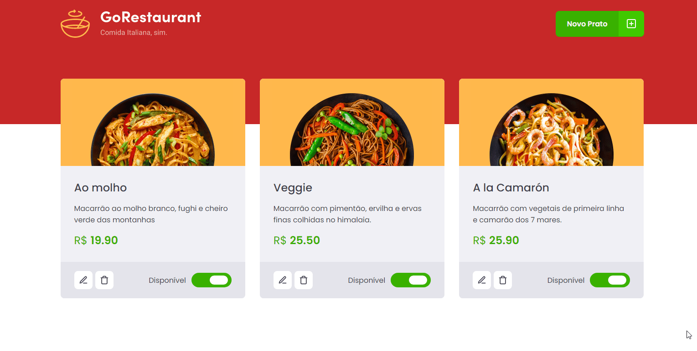

<p align="center">
     
</p>

<h1 align="center">
    
</h1>

<br>

## 🧪 Tecnologias

Esse projeto foi desenvolvido com as seguintes tecnologias:

- [React](https://reactjs.org)
- [TypeScript](https://www.typescriptlang.org/)
- [JSON-Server](https://github.com/typicode/json-server)

## 💻 Projeto

Uma simples lista de produtos, nesse desafio tinhamos que apenas passar toda a aplicação que estava sem typescript para com typescript, a aplicação em si já estava pronta.

</br>

## 🚀 Como executar

Clone o projeto e acesse a pasta do mesmo.

```bash
$ git clone https://github.com/ThyagoAraujoM/refactoring-classes-ts.git
```

Para iniciá-lo, siga os passos abaixo:

```bash
# Instalar as dependências
$ yarn

# Iniciar o projeto
$ yarn start

# Iniciar o servidor
$ yarn server
```

Agora você pode acessar [`localhost:3000`](http://localhost:3000) do seu navegador.

---

<h2 id="--Contributing"> 🤝 Contribuindo </h2>

Este projeto é para fins de estudo, então me envie um e-mail me contando o que você está fazendo e por que está fazendo, me ensine o que você sabe

Todos os tipos de contribuições são muito bem-vindos e apreciados!

⭐️ Iniciar o projeto
</br>
🐛 Encontrar e relatar problemas
</br>
📥 Envie PRs para ajudar a resolver problemas ou adicionar recursos

---

<h2 id="-autor">Autor</h2>

<a href="https://github.com/thyagoaraujom">
 
</br>
<p> Thyago Araujo <p>
</a>

[](https://www.linkedin.com/in/thyago-araujo-m/)
[](mailto:thyagoaraujomotta@gmail.com)

---

Feito com ❤️ por Thyago Araujo 👋🏽 [Entre em contato!](https://www.linkedin.com/in/thyago-araujo-m/)
